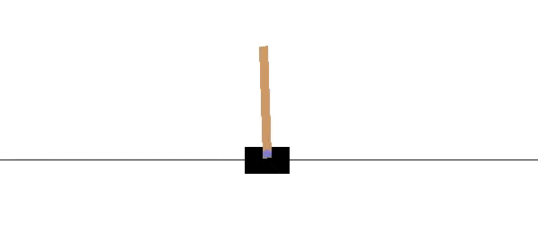

# [Markov Decision Process](https://en.wikipedia.org/wiki/Markov_decision_process)

## Summary

Markov decision process (MDP), also called a stochastic dynamic program or stochastic control problem, is a model for sequential decision making when outcomes are uncertain.

Originating from operations research in the 1950s, MDPs have since gained recognition in a variety of fields, including ecology, economics, healthcare, telecommunications and reinforcement learning.
 [Reinforcement learning](https://en.wikipedia.org/wiki/Reinforcement_learning) utilizes the MDP framework to model the interaction between a learning agent and its environment.
 In this framework, the interaction is characterized by states, actions, and rewards.
 The MDP framework is designed to provide a simplified representation of key elements of artificial intelligence challenges.
 These elements encompass the understanding of cause and effect, the management of uncertainty and nondeterminism, and the pursuit of explicit goals.

The name comes from its connection to [Markov chain](https://en.wikipedia.org/wiki/Markov_chain)s, a concept developed by the Russian mathematician [Andrey Markov](https://en.wikipedia.org/wiki/Andrey_Markov).
 The "Markov" in "Markov decision process" refers to the underlying structure of state transitions that still follow the [Markov property](https://en.wikipedia.org/wiki/Markov_property).
 The process is called a "decision process" because it involves making decisions that influence these state transitions, extending the concept of a [Markov chain](https://en.wikipedia.org/wiki/Markov_chain) into the realm of decision-making under uncertainty.

## Definition

A Markov decision process is a 4-tuple 
$\displaystyle (S,A,P_{a},R_{a})$
, where:

$\displaystyle S$
 is a set of states called the state space.
 The state space may be discrete or continuous, like the set of real numbers.

$\displaystyle A$
 is a set of actions called the action space (alternatively, 
$\displaystyle A_{s}$
 is the set of actions available from state 
$\displaystyle s$
).
 As for state, this set may be discrete or continuous.

$\displaystyle P_{a}(s,s')$
 is, on an intuitive level, the probability that action 
$\displaystyle a$
 in state 
$\displaystyle s$
 at time 
$\displaystyle t$
 will lead to state 
$\displaystyle s'$
 at time 
$\displaystyle t+1$
.
 In general, this probability transition is defined to satisfy 
$\displaystyle \Pr(s_{t+1}\in S'\mid s_{t}=s,a_{t}=a)=\int _{S'}P_{a}(s,s')ds',$
 for every 
$\displaystyle S'\subseteq S$
 measurable.
 In case the state space is discrete, the integral is intended with respect to the counting measure, so that the latter simplifies as  
$\displaystyle P_{a}(s,s')=\Pr(s_{t+1}=s'\mid s_{t}=s,a_{t}=a)$
; In case 
$\displaystyle S\subseteq \mathbb {R} ^{d}$
, the integral is usually intended with respect to the [Lebesgue measure](https://en.wikipedia.org/wiki/Lebesgue_measure).

$\displaystyle R_{a}(s,s')$
 is the immediate reward (or expected immediate reward) received after transitioning from state 
$\displaystyle s$
 to state 
$\displaystyle s'$
, due to action 
$\displaystyle a$
.

A policy function 
$\displaystyle \pi $
 is a (potentially probabilistic) mapping from state space (
$\displaystyle S$
) to action space (
$\displaystyle A$
).

### Optimization objective

The goal in a Markov decision process is to find a good "policy" for the decision maker: a function 
$\displaystyle \pi $
 that specifies the action 
$\displaystyle \pi (s)$
 that the decision maker will choose when in state 
$\displaystyle s$
.
 Once a Markov decision process is combined with a policy in this way, this fixes the action for each state and the resulting combination behaves like a [Markov chain](https://en.wikipedia.org/wiki/Markov_chain) (since the action chosen in state 
$\displaystyle s$
 is completely determined by 
$\displaystyle \pi (s)$
).

The objective is to choose a policy 
$\displaystyle \pi $
 that will maximize some cumulative function of the random rewards, typically the expected discounted sum over a potentially infinite horizon:

$\displaystyle E\left[\sum _{t=0}^{\infty }{\gamma ^{t}R_{a_{t}}(s_{t},s_{t+1})}\right]$
 (where we choose 
$\displaystyle a_{t}=\pi (s_{t})$
, i.
e.
 actions given by the policy).
 And the expectation is taken over 
$\displaystyle s_{t+1}\sim P_{a_{t}}(s_{t},s_{t+1})$

where 
$\displaystyle \ \gamma \ $
 is the discount factor satisfying 
$\displaystyle 0\leq \ \gamma \ \leq \ 1$
, which is usually close to 
$\displaystyle 1$
 (for example, 
$\displaystyle \gamma =1/(1+r)$
 for some discount rate 
$\displaystyle r$
).
 A lower discount factor motivates the decision maker to favor taking actions early, rather than postpone them indefinitely.

Another possible, but strictly related, objective that is commonly used is the 
$\displaystyle H-$
step return.
 This time, instead of using a discount factor 
$\displaystyle \ \gamma \ $
, the agent is interested only in the first 
$\displaystyle H$
 steps of the process, with each reward having the same weight.

$\displaystyle E\left[\sum _{t=0}^{H-1}{R_{a_{t}}(s_{t},s_{t+1})}\right]$
 (where we choose 
$\displaystyle a_{t}=\pi (s_{t})$
, i.
e.
 actions given by the policy).
 And the expectation is taken over 
$\displaystyle s_{t+1}\sim P_{a_{t}}(s_{t},s_{t+1})$

where 
$\displaystyle \ H\ $
 is the time horizon.
 Compared to the previous objective, the latter one is more used in Learning Theory.

A policy that maximizes the function above is called an optimal policy and is usually denoted 
$\displaystyle \pi ^{*}$
.
 A particular MDP may have multiple distinct optimal policies.
 Because of the [Markov property](https://en.wikipedia.org/wiki/Markov_property), it can be shown that the optimal policy is a function of the current state, as assumed above.

### Simulator models

In many cases, it is difficult to represent the transition probability distributions, 
$\displaystyle P_{a}(s,s')$
, explicitly.
 In such cases, a simulator can be used to model the MDP implicitly by providing samples from the transition distributions.
 One common form of implicit MDP model is an episodic environment simulator that can be started from an initial state and yields a subsequent state and reward every time it receives an action input.
 In this manner, trajectories of states, actions, and rewards, often called episodes may be produced.

Another form of simulator is a generative model, a single step simulator that can generate samples of the next state and reward given any state and action.
 (Note that this is a different meaning from the term generative model in the context of statistical classification.
) In algorithms that are expressed using pseudocode, 
$\displaystyle G$
 is often used to represent a generative model.
 For example, the expression 
$\displaystyle s',r\gets G(s,a)$
 might denote the action of sampling from the generative model where 
$\displaystyle s$
 and 
$\displaystyle a$
 are the current state and action, and 
$\displaystyle s'$
 and 
$\displaystyle r$
 are the new state and reward.
 Compared to an episodic simulator, a generative model has the advantage that it can yield data from any state, not only those encountered in a trajectory.

These model classes form a hierarchy of information content: an explicit model trivially yields a generative model through sampling from the distributions, and repeated application of a generative model yields an episodic simulator.
 In the opposite direction, it is only possible to learn approximate models through regression.
 The type of model available for a particular MDP plays a significant role in determining which solution algorithms are appropriate.
 For example, the dynamic programming algorithms described in the next section require an explicit model, and [Monte Carlo tree search](https://en.wikipedia.org/wiki/Monte_Carlo_tree_search) requires a generative model (or an episodic simulator that can be copied at any state), whereas most reinforcement learning algorithms require only an episodic simulator.

## Example

An example of MDP is the Pole-Balancing model, which comes from classic control theory.

In this example, we have

$\displaystyle S$
 is the set of ordered tuples 
$\displaystyle (\theta ,{\dot {\theta }},x,{\dot {x}})\subset \mathbb {R} ^{4}$
 given by pole angle, angular velocity, position of the cart and its speed.

$\displaystyle A$
 is 
$\displaystyle \{-1,1\}$
, corresponding to applying a force on the left (right) on the cart.

$\displaystyle P_{a}(s,s')$
 is the transition of the system, which in this case is going to be deterministic and driven by the laws of mechanics.

$\displaystyle R_{a}(s,s')$
 is 
$\displaystyle 1$
 if the pole is up after the transition, zero otherwise.
 Therefore, this function only depend on 
$\displaystyle s'$
 in this specific case.

## [Algorithms](https://en.wikipedia.org/wiki/Algorithm)

Solutions for MDPs with finite state and action spaces may be found through a variety of methods such as dynamic programming.
 The algorithms in this section apply to MDPs with finite state and action spaces and explicitly given transition probabilities and reward functions, but the basic concepts may be extended to handle other problem classes, for example using function approximation.
 Also, some processes with countably infinite state and action spaces can be exactly reduced to ones with finite state and action spaces.

The standard family of algorithms to calculate optimal policies for finite state and action MDPs requires storage for two arrays indexed by state: value 
$\displaystyle V$
, which contains real values, and policy 
$\displaystyle \pi $
, which contains actions.
 At the end of the algorithm, 
$\displaystyle \pi $
 will contain the solution and 
$\displaystyle V(s)$
 will contain the discounted sum of the rewards to be earned (on average) by following that solution from state 
$\displaystyle s$
.

The algorithm has two steps, (1) a value update and (2) a policy update, which are repeated in some order for all the states until no further changes take place.
  Both recursively update a new estimation of the optimal policy and state value using an older estimation of those values.

$\displaystyle V(s):=\sum _{s'}P_{\pi (s)}(s,s')\left(R_{\pi (s)}(s,s')+\gamma V(s')\right)$

$\displaystyle \pi (s):=\operatorname {argmax} _{a}\left\{\sum _{s'}P_{a}(s,s')\left(R_{a}(s,s')+\gamma V(s')\right)\right\}$

Their order depends on the variant of the algorithm; one can also do them for all states at once or state by state, and more often to some states than others.
 As long as no state is permanently excluded from either of the steps, the algorithm will eventually arrive at the correct solution.

### Notable variants

#### Value iteration

In value iteration (Bellman 1957), which is also called backward induction,
the 
$\displaystyle \pi $
 function is not used; instead, the value of 
$\displaystyle \pi (s)$
 is calculated within 
$\displaystyle V(s)$
 whenever it is needed.
 Substituting the calculation of 
$\displaystyle \pi (s)$
 into the calculation of 
$\displaystyle V(s)$
 gives the combined step:

$\displaystyle V_{i+1}(s):=\max _{a}\left\{\sum _{s'}P_{a}(s,s')\left(R_{a}(s,s')+\gamma V_{i}(s')\right)\right\},$

where 
$\displaystyle i$
 is the iteration number.
 Value iteration starts at 
$\displaystyle i=0$
 and 
$\displaystyle V_{0}$
 as a guess of the value function.
 It then iterates, repeatedly computing 
$\displaystyle V_{i+1}$
 for all states 
$\displaystyle s$
, until 
$\displaystyle V$
 converges with the left-hand side equal to the right-hand side (which is the "[Bellman equation](https://en.wikipedia.org/wiki/Bellman_equation)" for this problem).
 [Lloyd Shapley](https://en.wikipedia.org/wiki/Lloyd_Shapley)'s 1953 paper on stochastic games included as a special case the value iteration method for MDPs, but this was recognized only later on.

#### [Policy](https://en.wikipedia.org/wiki/Policy) iteration

In policy iteration (Howard 1960), step one is performed once, and then step two is performed once, then both are repeated until policy converges.
 Then step one is again performed once and so on.
 ([Policy](https://en.wikipedia.org/wiki/Policy) iteration was invented by Howard to optimize [Sears](https://en.wikipedia.org/wiki/Sears) catalogue mailing, which he had been optimizing using value iteration.
)
Instead of repeating step two to convergence, it may be formulated and solved as a set of linear equations.
 These equations are merely obtained by making 
$\displaystyle s=s'$
 in the step two equation.
 Thus, repeating step two to convergence can be interpreted as solving the linear equations by relaxation.

This variant has the advantage that there is a definite stopping condition: when the array 
$\displaystyle \pi $
 does not change in the course of applying step 1 to all states, the algorithm is completed.

[Policy](https://en.wikipedia.org/wiki/Policy) iteration is usually slower than value iteration for a large number of possible states.

#### Modified policy iteration

In modified policy iteration (van Nunen 1976; Puterman & Shin 1978), step one is performed once, and then step two is repeated several times.
 Then step one is again performed once and so on.

#### Prioritized sweeping

In this variant, the steps are preferentially applied to states which are in some way important – whether based on the algorithm (there were large changes in 
$\displaystyle V$
 or 
$\displaystyle \pi $
 around those states recently) or based on use (those states are near the starting state, or otherwise of interest to the person or program using the algorithm).

### Computational complexity

[Algorithms](https://en.wikipedia.org/wiki/Algorithm) for finding optimal policies with time complexity polynomial in the size of the problem representation exist for finite MDPs.
 Thus, decision problems based on MDPs are in computational complexity class P.
 However, due to the curse of dimensionality, the size of the problem representation is often exponential in the number of state and action variables, limiting exact solution techniques to problems that have a compact representation.
 In practice, online planning techniques such as [Monte Carlo tree search](https://en.wikipedia.org/wiki/Monte_Carlo_tree_search) can find useful solutions in larger problems, and, in theory, it is possible to construct online planning algorithms that can find an arbitrarily near-optimal policy with no computational complexity dependence on the size of the state space.

## Extensions and generalizations

A Markov decision process is a stochastic game with only one player.

### Partial observability

The solution above assumes that the state 
$\displaystyle s$
 is known when action is to be taken; otherwise 
$\displaystyle \pi (s)$
 cannot be calculated.
 When this assumption is not true, the problem is called a partially observable Markov decision process or POMDP.

### Constrained Markov decision processes

Constrained Markov decision processes (CMDPS) are extensions to Markov decision process (MDPs).
 There are three fundamental differences between MDPs and CMDPs.

There are multiple costs incurred after applying an action instead of one.

CMDPs are solved with linear programs only, and dynamic programming does not work.

The final policy depends on the starting state.

The method of Lagrange multipliers applies to CMDPs.

Many Lagrangian-based algorithms have been developed.

Natural policy gradient primal-dual method.

There are a number of applications for CMDPs.
 It has recently been used in motion planning scenarios in robotics.

### Continuous-time Markov decision process

In discrete-time Markov Decision Processes, decisions are made at discrete time intervals.
 However, for continuous-time Markov decision processes, decisions can be made at any time the decision maker chooses.
 In comparison to discrete-time Markov decision processes, continuous-time Markov decision processes can better model the decision-making process for a system that has continuous dynamics, i.
e.
, the system dynamics is defined by ordinary differential equations (ODEs).
 These kind of applications raise in queueing systems, epidemic processes, and population processes.

Like the discrete-time Markov decision processes, in continuous-time Markov decision processes the agent aims at finding the optimal policy which could maximize the expected cumulated reward.
 The only difference with the standard case stays in the fact that, due to the continuous nature of the time variable, the sum is replaced by an integral:

$\displaystyle \max \operatorname {E} _{\pi }\left[\left.
\int _{0}^{\infty }\gamma ^{t}r(s(t),\pi (s(t)))\,dt\;\right|s_{0}\right]$

where 
$\displaystyle 0\leq \gamma <1.
$

#### Discrete space: [Linear programming](https://en.wikipedia.org/wiki/Linear_programming) formulation

If the state space and action space are finite, we could use linear programming to find the optimal policy, which was one of the earliest approaches applied.
 Here we only consider the ergodic model, which means our continuous-time MDP becomes an ergodic continuous-time [Markov chain](https://en.wikipedia.org/wiki/Markov_chain) under a stationary policy.
 Under this assumption, although the decision maker can make a decision at any time in the current state, there is no benefit in taking multiple actions.
 It is better to take an action only at the time when system is transitioning from the current state to another state.
 Under some conditions, if our optimal value function 
$\displaystyle V^{*}$
 is independent of state 
$\displaystyle i$
, we will have the following inequality:

$\displaystyle g\geq R(i,a)+\sum _{j\in S}q(j\mid i,a)h(j)\quad \forall i\in S{\text{ and }}a\in A(i)$

If there exists a function 
$\displaystyle h$
, then 
$\displaystyle {\bar {V}}^{*}$
 will be the smallest 
$\displaystyle g$
 satisfying the above equation.
 In order to find 
$\displaystyle {\bar {V}}^{*}$
, we could use the following linear programming model:

Primal linear program(P-LP)

$\displaystyle {\begin{aligned}{\text{Minimize}}\quad &g\\{\text{s.
t}}\quad &g-\sum _{j\in S}q(j\mid i,a)h(j)\geq R(i,a)\,\,\forall i\in S,\,a\in A(i)\end{aligned}}$

Dual linear program(D-LP)

$\displaystyle {\begin{aligned}{\text{Maximize}}&\sum _{i\in S}\sum _{a\in A(i)}R(i,a)y(i,a)\\{\text{s.
t.
}}&\sum _{i\in S}\sum _{a\in A(i)}q(j\mid i,a)y(i,a)=0\quad \forall j\in S,\\&\sum _{i\in S}\sum _{a\in A(i)}y(i,a)=1,\\&y(i,a)\geq 0\qquad \forall a\in A(i){\text{ and }}\forall i\in S\end{aligned}}$

$\displaystyle y(i,a)$
 is a feasible solution to the D-LP if 
$\displaystyle y(i,a)$
 is nonnative and satisfied the constraints in the D-LP problem.
 A feasible solution 
$\displaystyle y^{*}(i,a)$
 to the D-LP is said to be an optimal solution if

$\displaystyle {\begin{aligned}\sum _{i\in S}\sum _{a\in A(i)}R(i,a)y^{*}(i,a)\geq \sum _{i\in S}\sum _{a\in A(i)}R(i,a)y(i,a)\end{aligned}}$

for all feasible solution 
$\displaystyle y(i,a)$
 to the D-LP.
 Once we have found the optimal solution 
$\displaystyle y^{*}(i,a)$
, we can use it to establish the optimal policies.

#### Continuous space: Hamilton–Jacobi–[Bellman equation](https://en.wikipedia.org/wiki/Bellman_equation)

In continuous-time MDP, if the state space and action space are continuous, the optimal criterion could be found by solving Hamilton–Jacobi–Bellman (HJB) partial differential equation.
 In order to discuss the HJB equation, we need to reformulate
our problem

$\displaystyle {\begin{aligned}V(s(0),0)={}&\max _{a(t)=\pi (s(t))}\int _{0}^{T}r(s(t),a(t))\,dt+D[s(T)]\\{\text{s.
t.
}}\quad &{\frac {ds(t)}{dt}}=f[t,s(t),a(t)]\end{aligned}}$

$\displaystyle D(\cdot )$
 is the terminal reward function, 
$\displaystyle s(t)$
 is the system state vector, 
$\displaystyle a(t)$
 is the system control vector we try to find.
 
$\displaystyle f(\cdot )$
 shows how the state vector changes over time.
 The Hamilton–Jacobi–[Bellman equation](https://en.wikipedia.org/wiki/Bellman_equation) is as follows:

$\displaystyle 0=\max _{u}(r(t,s,a)+{\frac {\partial V(t,s)}{\partial x}}f(t,s,a))$

We could solve the equation to find the optimal control 
$\displaystyle a(t)$
, which could give us the optimal value function 
$\displaystyle V^{*}$

## [Reinforcement learning](https://en.wikipedia.org/wiki/Reinforcement_learning)

[Reinforcement learning](https://en.wikipedia.org/wiki/Reinforcement_learning) is an interdisciplinary area of machine learning and optimal control that has, as main objective, finding an approximately optimal policy for MDPs where transition probabilities and rewards are unknown.

[Reinforcement learning](https://en.wikipedia.org/wiki/Reinforcement_learning) can solve Markov-Decision processes without explicit specification of the transition probabilities which are instead needed to perform policy iteration.
 In this setting, transition probabilities and rewards must be learned from experience, i.
e.
 by letting an agent interact with the MDP for a given number of steps.
 Both on a theoretical and on a practical level, effort is put in maximizing the sample efficiency, i.
e.
 minimimizing the number of samples needed to learn a policy whose performance is 
$\displaystyle \varepsilon -$
close to the optimal one (due to the stochastic nature of the process, learning the optimal policy with a finite number of samples is, in general, impossible).

### Reinforcement Learning for discrete MDPs

For the purpose of this section, it is useful to define a further function, which corresponds to taking the action 
$\displaystyle a$
 and then continuing optimally (or according to whatever policy one currently has):

$\displaystyle \ Q(s,a)=\sum _{s'}P_{a}(s,s')(R_{a}(s,s')+\gamma V(s')).
\ $

While this function is also unknown, experience during learning is based on 
$\displaystyle (s,a)$
 pairs (together with the outcome 
$\displaystyle s'$
; that is, "I was in state 
$\displaystyle s$
 and I tried doing 
$\displaystyle a$
 and 
$\displaystyle s'$
 happened").
 Thus, one has an array 
$\displaystyle Q$
 and uses experience to update it directly.
 This is known as [Q-learning](https://en.wikipedia.org/wiki/Q-learning).

## Other scopes

### [Learning automata](https://en.wikipedia.org/wiki/Learning_automaton)

Another application of MDP process in machine learning theory is called learning automata.
 This is also one type of reinforcement learning if the environment is stochastic.
 The first detail learning automata paper is surveyed by Narendra and Thathachar (1974), which were originally described explicitly as finite-state automata.
 Similar to reinforcement learning, a learning automata algorithm also has the advantage of solving the problem when probability or rewards are unknown.
 The difference between learning automata and [Q-learning](https://en.wikipedia.org/wiki/Q-learning) is that the former technique omits the memory of Q-values, but updates the action probability directly to find the learning result.
 [Learning automata](https://en.wikipedia.org/wiki/Learning_automaton) is a learning scheme with a rigorous proof of convergence.

In learning automata theory, a stochastic automaton consists of:

a set x of possible inputs,
a set Φ = { Φ1, .
.
.
, Φs } of possible internal states,
a set α = { α1, .
.
.
, αr } of possible outputs, or actions, with r ≤ s,
an initial state probability vector p(0) = ≪ p1(0), .
.
.
, ps(0) ≫,
a computable function A which after each time step t generates p(t + 1) from p(t), the current input, and the current state, and
a function G: Φ → α which generates the output at each time step.

The states of such an automaton correspond to the states of a "discrete-state discrete-parameter [Markov process](https://en.wikipedia.org/wiki/Markov_chain)".
 At each time step t = 0,1,2,3,.
.
.
, the automaton reads an input from its environment, updates P(t) to P(t + 1) by A, randomly chooses a successor state according to the probabilities P(t + 1) and outputs the corresponding action.
 The automaton's environment, in turn, reads the action and sends the next input to the automaton.

### Category theoretic interpretation

Other than the rewards, a Markov decision process 
$\displaystyle (S,A,P)$
 can be understood in terms of [Category theory](https://en.wikipedia.org/wiki/Category_theory).
 Namely, let 
$\displaystyle {\mathcal {A}}$
 denote the free monoid with generating set A.
 Let Dist denote the [Kleisli category](https://en.wikipedia.org/wiki/Kleisli_category) of the Giry monad.
 Then a functor 
$\displaystyle {\mathcal {A}}\to \mathbf {Dist} $
 encodes both the set S of states and the probability function P.

In this way, Markov decision processes could be generalized from monoids (categories with one object) to arbitrary categories.
 One can call the result 
$\displaystyle ({\mathcal {C}},F:{\mathcal {C}}\to \mathbf {Dist} )$
 a context-dependent Markov decision process, because moving from one object to another in 
$\displaystyle {\mathcal {C}}$
 changes the set of available actions and the set of possible states.

## Alternative notations

The terminology and notation for MDPs are not entirely settled.
 There are two main streams — one focuses on maximization problems from contexts like economics, using the terms action, reward, value, and calling the discount factor β or γ, while the other focuses on minimization problems from engineering and navigation, using the terms control, cost, cost-to-go, and calling the discount factor α.
 In addition, the notation for the transition probability varies.

In addition, transition probability is sometimes written 
$\displaystyle \Pr(s,a,s')$
, 
$\displaystyle \Pr(s'\mid s,a)$
 or, rarely, 
$\displaystyle p_{s's}(a).
$

## See also

## References

## Further reading

Bellman.
, R.
 E.
 (2003) [1957].
 Dynamic Programming (Dover paperback ed.
).
 Princeton, NJ: Princeton University Press.
 ISBN 978-0-486-42809-3.

Bertsekas, D.
 (1995).
 Dynamic Programming and Optimal Control.
 Vol.
 2.
 MA: Athena.

Derman, C.
 (1970).
 Finite state Markovian decision processes.
 Academic Press.

Feinberg, E.
A.
; Shwartz, A.
, eds.
 (2002).
 Handbook of Markov Decision Processes.
 Boston, MA: Kluwer.
 ISBN 9781461508052.

Guo, X.
; Hernández-Lerma, O.
 (2009).
 Continuous-Time Markov Decision Processes.
 Stochastic Modelling and Applied Probability.
 Springer.
 ISBN 9783642025464.

Meyn, S.
 P.
 (2007).
 Control Techniques for Complex Networks.
 Cambridge University Press.
 ISBN 978-0-521-88441-9.
 Archived from the original on 19 June 2010.
 Appendix contains abridged "Meyn & Tweedie".
 Archived from the original on 18 December 2012.

Puterman.
, M.
 L.
 (1994).
 Markov Decision Processes.
 Wiley.

Ross, S.
 M.
 (1983).
 Introduction to stochastic dynamic programming (PDF).
 Academic press.

Sutton, R.
 S.
; Barto, A.
 G.
 (2017).
 Reinforcement Learning: An Introduction.
 Cambridge, MA: The MIT Press.

Tijms.
, H.
C.
 (2003).
 A First Course in Stochastic Models.
 Wiley.
 ISBN 9780470864289.

## References

- https://netfiles.uiuc.edu/meyn/www/spm_files/CTCN/CTCN.html
- https://netfiles.uiuc.edu/meyn/www/spm_files/book.html
- http://ncatlab.org/nlab/show/Giry+monad
- https://web.archive.org/web/20100619011046/https://netfiles.uiuc.edu/meyn/www/spm_files/CTCN/CTCN.html
- https://web.archive.org/web/20121218173202/https://netfiles.uiuc.edu/meyn/www/spm_files/book.html
- https://www.springer.com/mathematics/applications/book/978-3-642-02546-4
- http://incompleteideas.net/sutton/book/the-book-2nd.html
- http://jmvidal.cse.sc.edu/library/shoham03a.pdf
- http://www.deeplearningitalia.com/wp-content/uploads/2018/03/Introduction-to-Stochastic-Dynamic-Programming-Ross.pdf
- https://www.researchgate.net/publication/270105954
- https://ui.adsabs.harvard.edu/abs/1953PNAS...39.1095S
- https://archive.org/details/learningautomata00nare
- https://api.semanticscholar.org/CorpusID:5167748
- https://books.google.com/books?id=TpwKCAAAQBAJ
- https://books.google.com/books?id=WibF8iVHaiMC
- https://pubsonline.informs.org/doi/10.1287/opre.50.1.100.17788
- https://doi.org/10.1023%2FA:1017932429737
- https://www.ncbi.nlm.nih.gov/pmc/articles/PMC1063912
- https://doi.org/10.1073%2Fpnas.39.10.1095
- https://pubmed.ncbi.nlm.nih.gov/16589380
- https://doi.org/10.1287%2Fmnsc.24.11.1127
- https://doi.org/10.1007%2Fbf01920264
- https://citeseerx.ist.psu.edu/viewdoc/summary?doi=10.1.1.295.2280
- https://doi.org/10.1109%2FTSMC.1974.5408453
- https://pubsonline.informs.org/doi/abs/10.1287/moor.12.3.441
- https://doi.org/10.1287%2Fmoor.12.3.441
- https://hdl.handle.net/1721.1%2F2893
- https://search.worldcat.org/issn/0018-9472
- https://dl.acm.org/doi/10.1145/1455567.1455587
- https://doi.org/10.1145%2F1455567.1455587
- https://doi.org/10.1016%2FS0019-9958(58)80003-0
- https://linkinghub.elsevier.com/retrieve/pii/S0019995858800030
- https://search.worldcat.org/issn/0019-9958
- https://doi.org/10.1007%2F978-3-642-02547-1
- https://link.springer.com/book/10.1007/978-3-642-02547-1
- https://doi.org/10.1007%2Fbf01919083
- https://api.semanticscholar.org/CorpusID:2545336

## URL

https://en.wikipedia.org/wiki/Markov_decision_process

## Images

## Images

